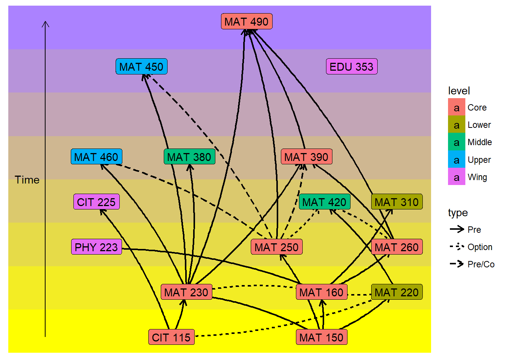

# Math Major
Matt Rissler  
`r format(Sys.Date())`  

## The Major-Start Odd Year

<!-- -->

## The Colors

- Everything in the Core
- At least one Wing
- At least one Upper
- At least two of Middle or Upper
- At least four of Lower, Middle, or Uppper

## Rotation of Classes
Courses that are not listed occur every semester.

Code      Title                        Semester 
--------  ---------------------------  ---------
PHY 223   Physics for Mathematicians   Fall     
MAT 220   Prob/Stats                   Spring   
MAT 230   Discrete Math                Spring   
MAT 250   Linear Algebra               Fall     
MAT 310   ODEs                         Spring   

## Rotation of Classes

Code      Title                Semester    
--------  -------------------  ------------
MAT 370   Modern Geometry      Odd Falls   
MAT 380   Numerical Analysis   Odd Springs 
EDU 353   Math Methods         Even Falls  
MAT 450   Algebra              Even Falls  
MAT 460   Real Analysis        Odd Falls   
MAT 490   Capstone             Spring      
